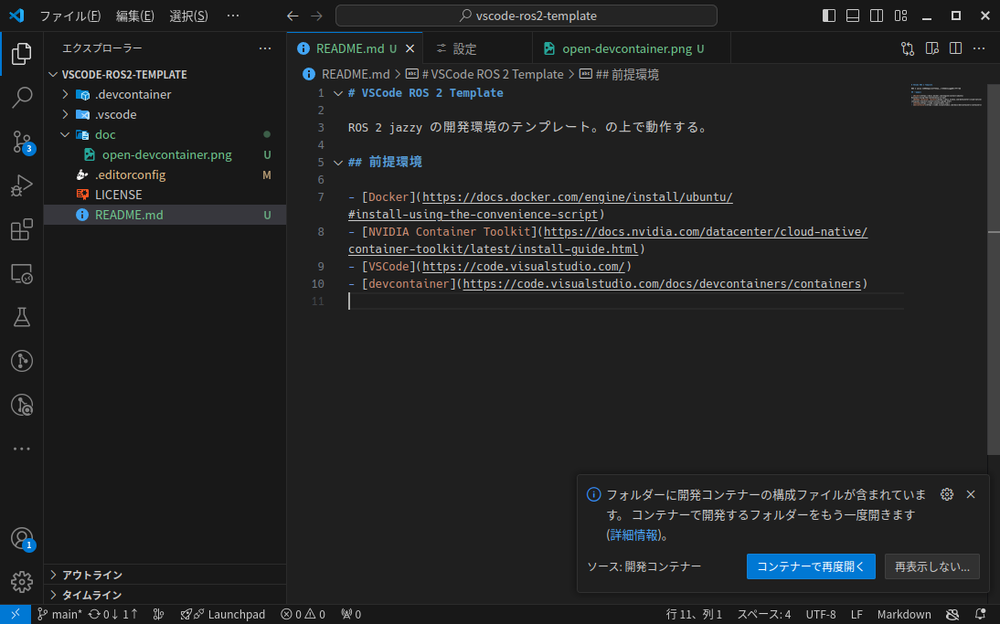

# Navigation Trial

humble

## 前提環境

- [Docker](https://docs.docker.com/engine/install/ubuntu/#install-using-the-convenience-script)
- [NVIDIA Container Toolkit](https://docs.nvidia.com/datacenter/cloud-native/container-toolkit/latest/install-guide.html)
- [VSCode](https://code.visualstudio.com/)
- [devcontainer](https://code.visualstudio.com/docs/devcontainers/containers)

VSCodeでリポジトリを開くと「コンテナーで再度開く」と聞かれるので、それをクリックする。あるいは、コマンドパレット(`Ctrl+P`)で `Dev Containers: Reopen in Container` を実行する。




## 実行方法

いずれも `nav_ws` で実行する。

```shell
# ターミナル1
# ビルド
task build

# gazebo と navigation の起動
task sim
```

```shell
# ターミナル2
# ウェイポイントを渡す
task run
```

## 内容について

### penguin_nav

ナビゲーションを行うパッケージ。 `nav2` の `navigation_launch.py` を使う launch ファイルと、それに渡す設定を含む。また、ウェイポイントを渡すノードとして `follow_path` を定義している。

nav2 の設定は以下の通り

- `/opt/ros/humble/share/turtlebot3_navigation2/param/waffle.yaml` ベース
- `global_costmap` の `width`, `height`, `origin_x`, `origin_y` を設定
- `global_cosstmap` の `static_layer` を削除


### penguin_bringup_sim

gazebo(classic) でナビゲーションを評価するパッケージ。
